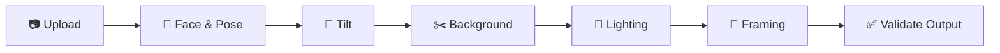

<a name="readme-top"></a>

<div align="center">


<br/>

# China Visa Generator

### Your China visa photo, done right. For free.

Built to the Chinese MFA 2016 photo requirements: tilt, lighting, background<br/>
and framing checks. No signup. No watermarks. No data stored.

<br/>

[](LICENSE)
[](https://python.org)
[](https://nextjs.org)
[](https://fastapi.tiangolo.com)

<br/>

[Demo](#demo) · [Features](#-features) · [Getting Started](#-getting-started) · [Photo Spec](#-photo-spec) · [Tech Stack](#-tech-stack) · [API](#-api) · [Deployment](#-deployment) · [License](#-license)

<br/>

</div>

## Demo

https://github.com/user-attachments/assets/564aa3e6-de8d-40bb-81aa-8ddfce3dc8fe

<br/>

## ✨ Features

<table>
<tr>
<td width="50%">

### AI Processing
- **Face Landmarks** and head pose via MediaPipe Face Landmarker
- **Tilt Correction** from background lines and shoulders
- **Background Removal** using BiRefNet-portrait with matte QA
- **Framing** solved for crown, eye line, face width and chin clearance
</td>
<td width="50%">

### User Tools
- **Side by Side** view with guides and mask preview
- **Correction Toggles** and manual sliders with undo/redo
- **Grouped Checks** with retake advice
- **Print Sheet** grid for common paper sizes
</td>
</tr>
<tr>
<td width="50%">

### Output Quality
- **Output Validation** re-decodes and re-measures the exported JPEG
- **Digital and Paper** profiles: 420×560 px / 40–120 KB, and 33×48 mm

</td>
<td width="50%">

### Zero Friction
- **Wide Format Support** for HEIC, AVIF, JPEG, PNG, WebP, BMP
- **100% Free** with no accounts or watermarks
- **Privacy First** with no data stored on server
- **Installable** as a PWA on phone and desktop

</td>
</tr>
</table>

<br/>

## 🔄 Processing Pipeline



<br/>

## 🚀 Getting Started

### Prerequisites

| Requirement | Version |
|---|---|
| Python | 3.11+ |
| Node.js | 18+ |

### Backend

```bash
cd backend
python3 -m venv venv
source venv/bin/activate
pip install -r requirements.txt
uvicorn app.main:app --reload --port 8000
```

> The ML model (~170MB BiRefNet) downloads automatically on first request.

| | URL |
|---|---|
| API | http://localhost:8000 |
| Docs | http://localhost:8000/docs |

### Frontend

```bash
cd frontend
npm install
npm run dev
```

Open http://localhost:3000

<br/>

## 🌍 Photo Spec

| Profile | Size | Background | Source |
|---|---|---|---|
| Digital (online application) | 420×560 px, 40–120 KB JPEG | White | MFA 2016 |
| Paper | 33×48 mm | White | MFA 2016 |

The full spec, with every threshold marked verified or provisional, is in [shared/specs/china_visa.v1.json](shared/specs/china_visa.v1.json).

<br/>

## 🛠 Tech Stack

<table>
<tr><th align="left">Backend</th><th align="left">Frontend</th></tr>
<tr>
<td valign="top">

| Library | Purpose |
|---|---|
| FastAPI + Uvicorn | API server |
| MediaPipe | Face and pose landmarks |
| OpenCV | Geometry and tilt |
| rembg (BiRefNet) | Background removal |
| PyMatting | Alpha matting |
| Pillow + pillow-heif | Image I/O |

</td>
<td valign="top">

| Library | Purpose |
|---|---|
| Next.js 16 + React 19 | App framework |
| TypeScript | Type safety |
| Tailwind CSS 4 | Styling |
| Axios | HTTP client |

</td>
</tr>
</table>

<br/>

## 📡 API

| Method | Endpoint | Description |
|---|---|---|
| `GET` | `/api/health` | Health check |
| `POST` | `/api/v2/process` | China visa engine: tilt, background, lighting, geometry, and validation of the exported file |
| `GET` | `/api/v2/spec/china_visa` | Versioned China visa spec (MFA 2016) |

The China visa engine is documented in [docs/china-visa-engine.md](docs/china-visa-engine.md).

<br/>

## 📁 Project Structure

<details>
<summary>Click to expand</summary>

```
visachinagen/
├── backend/
│   ├── app/
│   │   ├── api/routes/
│   │   └── pipeline/
│   ├── Dockerfile
│   └── requirements.txt
├── frontend/
│   ├── app/
│   └── src/
│       ├── components/
│       ├── hooks/
│       └── lib/
└── shared/
    └── specs/china_visa.v1.json
```

</details>

<br/>

## 🚢 Deployment

| Service | Platform | Notes |
|---|---|---|
| Frontend | [Vercel](https://vercel.com) | Edge CDN, auto-deploy from `main` |
| Backend | [HuggingFace Spaces](https://huggingface.co/spaces) | Docker, 16GB RAM, 2 vCPU |

The backend `Dockerfile` is configured for HuggingFace Spaces with pre-downloaded models.

The frontend is a Progressive Web App (`app/manifest.ts`, `public/sw.js`). The service worker is
registered in production builds only. It caches the app shell for offline use and never caches
`/api` or photos. Bump `VERSION` in `public/sw.js` to drop old caches.

<br/>

## 📄 License

[MIT](LICENSE). Based on [PhotoGen](https://github.com/deidaraiorek/photogen) by deidaraiorek.

<div align="right">

[](#readme-top)

</div>
